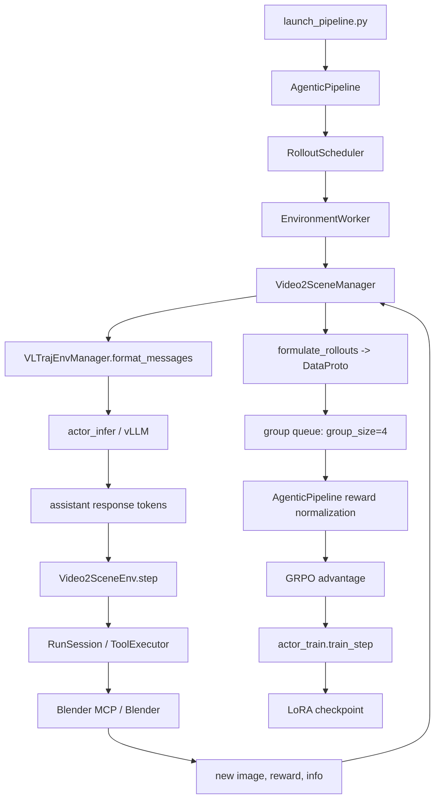
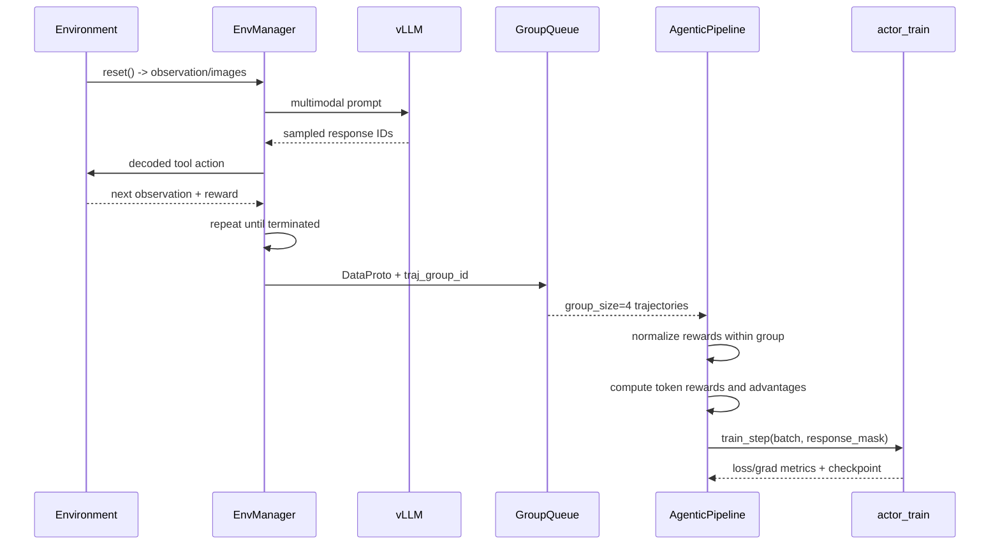

# ROLL Agent Rollout 数据与训练资格说明

本文以当前仓库的 Video2Scene 接入为例，解释一条 Agent rollout 从环境交互到 GRPO 更新的完整数据流。目标是回答两个问题：

1. 一条多轮 rollout 里，哪些内容只是环境记录，哪些内容会进入训练 batch？
2. 在训练 batch 里，哪些 token 会产生 policy loss，哪些 token 只是上下文、图像输入或诊断信息？

代码基线：`/home/xuboshen/zgw/ROLL`，Video2Scene 接入位于 `v2s_integration/`。

## 1. 目录地图

```text
ROLL/
├── examples/                         # 官方训练配置与启动模板
├── roll/pipeline/agentic/
│   ├── agentic_pipeline.py           # rollout → reward/advantage → train_step 主循环
│   ├── environment_worker.py         # 创建环境管理器并并发运行 episode
│   ├── env_manager/
│   │   └── vl_traj_env_manager.py    # 多轮文本/图像 prompt、生成、轨迹序列化
│   └── proxy/                         # 需要网络代理环境时的路由
├── roll/distributed/scheduler/
│   ├── rollout_scheduler.py          # group、episode、batch 收集与调度
│   └── protocol.py                    # DataProto：tensor、非 tensor、meta_info 容器
├── roll/utils/                       # reward、advantage、动态 batch 等公共逻辑
├── v2s_integration/
│   ├── launch_pipeline.py             # 当前 Video2Scene 原生入口
│   ├── v2s_env.py                     # reset/step/close 与 Blender/MCP
│   ├── v2s_manager.py                 # VLTrajEnvManager 的多模态/Token 适配
│   ├── token_history.py               # 还原实际采样 token
│   ├── native_config.yaml             # 展开后的实验配置
│   ├── native_episodes/                # 每条 episode 的事件、图片、场景文件
│   └── native_run/                    # TensorBoard、rollout dump、checkpoint、日志
└── docs/                              # 框架和实验说明
```

## 2. 总体流程



一条 rollout 结束的条件是环境返回 `terminated=True`，或者达到环境最大步数。ROLL 会先收集一个 group 的多条轨迹，再做组内 reward 比较；当前配置的 `group_size=4`。

## 3. 一条 episode 的原始环境数据

`v2s_env.py` 的 `reset()` 返回一个 observation 和环境信息：

```python
observation = {
    "prompt": [
        {"type": "text", "text": instruction},
        {"type": "image"},              # reference image
        {"type": "image"},              # current image
    ],
    "image": [reference_pil, current_pil],
}
info = {"env_instruction": "..."}
```

每次 `step(action)` 后返回：

```python
observation, reward, terminated, truncated, info
```

当前 Video2Scene 的 episode 事件会落到：

```text
native_episodes/<task>_<seed>_<uuid>/events.json
```

单条事件的逻辑结构如下：

```json
{
  "step": 1,
  "action": "{\"name\":\"execute_blender_code\",...}",
  "tool": {"status": "success", "...": "..."},
  "error": null,
  "score": {"mse": 0.012, "reward": 0.70},
  "terminal": false
}
```

这些字段对环境复现和错误诊断很有用，但它们不会原样作为 actor 的训练输入。

### 原始事件字段的训练意义

| 字段 | 来源 | 是否直接进入 policy loss | 用途 |
|---|---|---:|---|
| `observation` | 环境返回的文本/图像 | 否，先转成 prompt token 与多模态特征 | 下一轮上下文 |
| `action` | 模型生成的字符串 | 否，先 decode/再由 tokenizer 保留实际 response token | policy loss 的 token 来源 |
| `tool` | MCP/ToolExecutor | 否 | 工具成功率和故障诊断 |
| `reward` | 环境 | 否，先变成 episode/group reward | response-level reward、advantage |
| `terminated/truncated` | 环境 | 否 | episode 生命周期 |
| `info.metrics` | 环境 | 否 | dashboard 与日志 |
| `events.json` | 环境落盘 | 否 | 可复现审计与离线分析 |

## 4. ROLL 的 DataProto 数据格式

`roll/distributed/scheduler/protocol.py` 定义的 `DataProto` 有三层：

```text
DataProto
├── batch: TensorDict              # 张量，训练/推理直接消费
├── non_tensor_batch: dict         # numpy object array，样本身份和可变对象
└── meta_info: dict                # 这批数据的控制信息和指标
```

### 4.1 `batch`：训练张量

当前 Video2Scene `formulate_rollouts()` 至少构造这些字段：

| 字段 | 形状概念 | 含义 | 训练资格 |
|---|---|---|---|
| `input_ids` | `[B, S]` | 文本 token 和图像占位 token | 作为模型输入 |
| `attention_mask` | `[B, S]` | 有效序列位置 | 控制 attention |
| `position_ids` | `[B, S]` 或多模态扩展形状 | 位置编码 | 作为模型输入 |
| `response_mask` | `[B, S]` | 1 表示模型实际采样的 assistant token | **决定 policy loss 位置** |
| `prompt_mask` | `[B, S]` | prompt 区域标记 | 诊断和数据统计 |
| `scores` | `[B, S]` | 通常只在最后一个 response token 放 episode score | reward 入口 |
| `old_log_probs` | `[B, S-1]` | 旧策略对 response 的 log probability | PPO/GRPO 比率计算 |
| `ref_log_probs` | `[B, S-1]` | reference 或 mock reference 的 log probability | KL/约束，按配置启用 |
| `advantages` | `[B, S-1]` | token 或 response 级优势 | policy loss 权重 |
| `token_level_rewards` | `[B, S-1]` | 每个 token 的 reward/ KL 修正 | advantage 计算 |

`input_ids` 的长度会被截断或 pad 到 `sequence_length`。pad 位的 `attention_mask`、`response_mask` 和 `scores` 都应为 0。

### 4.2 `non_tensor_batch`：身份、分组和可视化索引

当前 Video2Scene 写入：

```python
{
    "env_ids": ...,             # 环境实例
    "group_ids": ...,           # ROLL 调度 group
    "messages_list": ...,       # 完整多轮消息
    "tags": ...,                # Video2Scene 等任务标签
    "step_scores": ...,         # 每一轮 reward 列表
    "episode_scores": ...,      # sum(step_scores)
    "traj_group_id": ...,       # GRPO 组键
    "traj_id": ...,             # 单条轨迹键
    "sample_uuid": ...,         # 训练样本唯一键
}
```

这些字段通常不直接参与反向传播，但决定：

- 哪些轨迹属于同一个 GRPO group；
- 如何按环境/任务/场景聚合指标；
- 如何从 TensorBoard 指标回溯到 episode 文件；
- 如何做过滤、去重、异常样本定位。

### 4.3 `meta_info`：批次控制和指标

常见字段包括：

```python
{
    "global_step": 0,
    "metrics": {...},
    "loss_mask_keys": ["response_mask"],
    "_broadcast_non_tensor_batch": True,
}
```

`loss_mask_keys` 是重要契约：它告诉训练端哪些 mask 控制 loss。当前配置明确使用 `response_mask`。

## 5. 哪些内容值得训练，哪些不值得训练

可以用下面的判断标准：**只有模型生成的有效 response token，且对应一个可解释的 reward/advantage，才应该进入 policy loss。**

### 应该训练的部分

```text
有效 prompt 上下文
  + 模型实际采样的 assistant response token
  + 与该 response 对齐的 advantage/reward
```

对当前 Video2Scene：

- 模型输出的 JSON 工具调用 token；
- 多轮中每一轮真实采样的动作 token；
- response token 对应的 `old_log_probs`、`advantages`；
- 由最终场景质量产生的终局 reward 传播结果。

### 不应该训练的部分

| 内容 | 原因 |
|---|---|
| system prompt、任务说明、历史 observation token | 它们是条件，不是当前策略动作 |
| image token / image feature | 图像是输入模态，不是模型要优化的动作 token |
| Chat template 自动补出的 `<|im_end|>`、换行或未采样 EOS | 它们不是实际行为，加入 loss 会制造 token drift |
| tool execution result 原文 | 是环境反馈，应通过 reward 影响动作，而不是当作动作标签 |
| Blender 日志、MCP 日志 | 只用于诊断 |
| padding token | 没有语义，必须 mask 掉 |
| aborted/空 response | 没有可归因的动作，当前实现应拒绝这条轨迹 |
| 解析失败但没有明确 reward 的输出 | 除非定义了稳定的格式惩罚，否则不能混入正常优势估计 |

### 当前实现如何保证边界

`v2s_manager.py` 不是重新 encode 一遍字符串来猜 response，而是保存真实采样 token：

```text
vLLM sampled IDs
    ↓ preserve_responses()
训练侧 input_ids
    ↓ exact prefix/response match
response_mask
```

它还检查：

```text
exact_generated_token_match == True
image_tokens_in_loss == 0
prompt_match == True
response_match == True
```

这些检查失败时，轨迹会被拒绝，避免“看起来有数据、实际上训练了错误 token”。

## 6. GRPO 的数据流



GRPO 的核心不是单条 reward 的绝对值，而是同一 group 中的相对质量。当前配置中的概念可以写成：

```text
r_i = sum(step_rewards_i)
A_i = normalize_group({r_1, ..., r_4})[i]
loss = policy_loss(response_tokens, A_i, response_mask)
```

如果 4 条轨迹 reward 完全相同，组内标准差接近 0，advantage 信息会退化；因此 dashboard 必须展示 group reward 的均值、标准差、min/max 和有效样本数。

## 7. 代码级执行顺序

1. `v2s_integration/launch_pipeline.py:config()` 构造 `AgenticConfig`。
2. `AgenticPipeline.__init__()` 创建 actor train、actor infer 和两个 `RolloutScheduler`。
3. `EnvironmentWorker.initialize()` 动态导入 `Video2SceneManager`。
4. `VLTrajEnvManager.run_rollout_loop()` 循环调用 `make_decision()` 和 `step()`。
5. `Video2SceneManager.format_messages()` 恢复真实 token 并准备图像特征。
6. `llm_proxy.generate()` 调用 vLLM。
7. `Video2SceneEnv.step()` 执行 Blender 工具并产生 reward。
8. `Video2SceneManager.formulate_rollouts()` 生成 `DataProto` 和训练 contract。
9. `RolloutScheduler` 按 group 收集 trajectory。
10. `AgenticPipeline.run()` 调用 reward normalization、`agentic_compute_advantage()` 和 `actor_train.train_step()`。
11. `BasePipeline` 根据 `save_steps` 保存 checkpoint。

## 8. 读数据时的检查清单

拿到一条 rollout，先检查：

```text
[ ] traj_id / traj_group_id 是否存在
[ ] 每轮 prompt、response、reward 是否能按顺序还原
[ ] response_mask 的 1 是否只覆盖真实 sampled response
[ ] image token 是否没有进入 response_mask
[ ] response_mask.sum() 是否大于 0
[ ] episode_scores 是否与 step_scores 求和一致
[ ] group 内是否至少有两个不同 reward
[ ] invalid_action、tool_error、truncated 是否单独统计
[ ] training_contract 是否通过 exact token 检查
[ ] reward 是否来自当前定义的版本
```
